# Push-up catalog (home)

Use these names in the Gym log so we can match sessions to this file. Target **RIR 2–3**. If a set is too easy, move **down** this list (harder) or add a set/reps. If you miss RIR 2–3 the other way, move **up** (easier).

## Short guide

A push-up is a moving plank. Keep a stiff line while the arms bend and straighten. Chest and triceps work. Neck, low back, and hips stay quiet.

### Principles

1. Brace first. Glutes and abs on before the elbows bend.
2. Full range. Chest to about a fist off the floor. Lock out at the top without shrugging.
3. Elbows about **45°** from the body, not flared to 90°. (Narrow, low, and diamond stay tucked on purpose.)
4. One speed. About two seconds down, press up. No bounce, no half reps.
5. Stop while it is still a push-up. Last 2–3 reps hard, form still clean. That is RIR 2–3.

### What a good one should feel like

- Load in the chest and the back of the arms, not the neck.
- Shoulders packed, not creeping toward the ears.
- Last reps feel far from the floor, but the line still holds.
- You could grind 2–3 more clean reps if you had to. That is the target, not failure.
- Low back sags: abs quit. Butt pikes: you are hiding from the range. Front of the shoulder or wrists bark: hands too far forward or elbows flared.

### How to get it

- Match the catalog photo for that ID before the set.
- First rep is a check: can you pause a beat at the bottom with the line intact? If not, go one easier ID.
- Side view is the truth. Film one set when you can and compare to the photo.
- Two sessions in a row at RIR 2–3 with clean form: add reps, add a set, or take the next harder ID.
- Broken line or cut range: that set does not count. Easier ID next time.

## Form (every version)

- Body in one line: head, ribs, hips, heels. No sag, no pike.
- Squeeze glutes and brace abs like a plank.
- Hands planted, fingers forward. Screw the palms into the floor (outer elbows slightly in).
- Elbows about **45°** from the body, not flared to 90°.
- Chest travels to about a fist off the floor. Lock out at the top without shrugging.
- Neck long. Look at the floor a bit ahead, not up.
- Breathe in on the way down, out on the way up.

If hips sag or you only move the first half, that’s a miss. Drop to an easier version rather than cheating the range.

## Catalog

Easier → harder. All bodyweight unless noted.

### pu-wall — Wall push-up

Hands on wall, body straight, walk feet back. Chest, triceps, shoulders. Use when the floor is too hard.

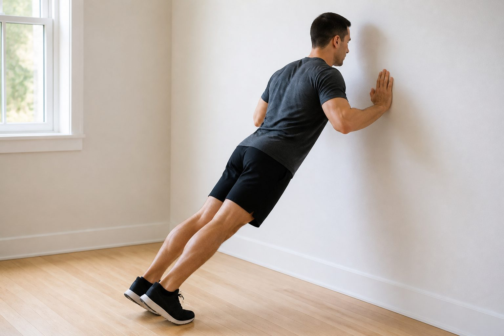

### pu-incline — Incline push-up

Hands on bench, sofa, or table. Building volume.

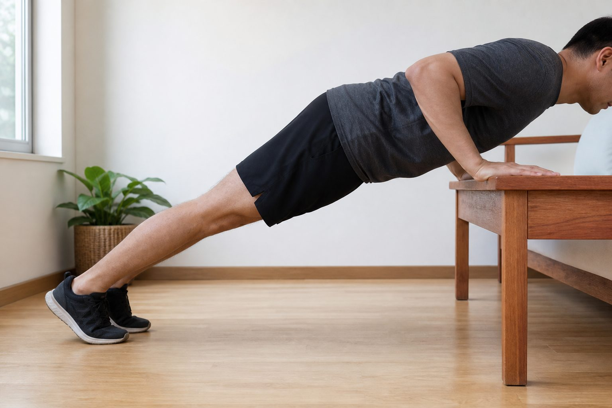

### pu-knee — Knee push-up

Knees down, still a straight line from head to knees. Last reps when full form breaks.

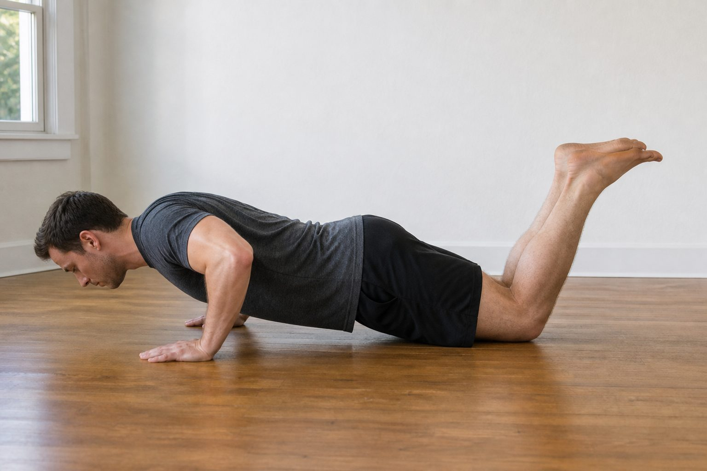

### pu-std — Standard push-up

Hands under shoulders, feet together or small V. Default.

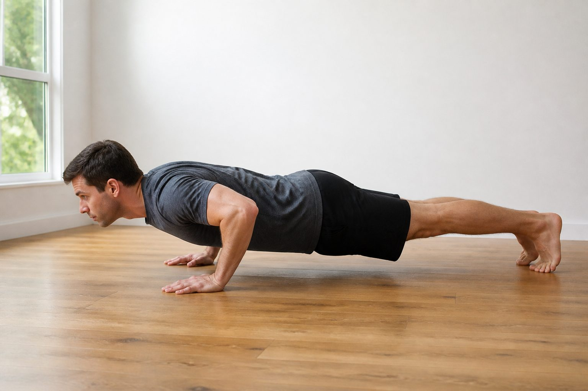

### pu-wide — Wide push-up

Hands outside shoulders. Chest bias.

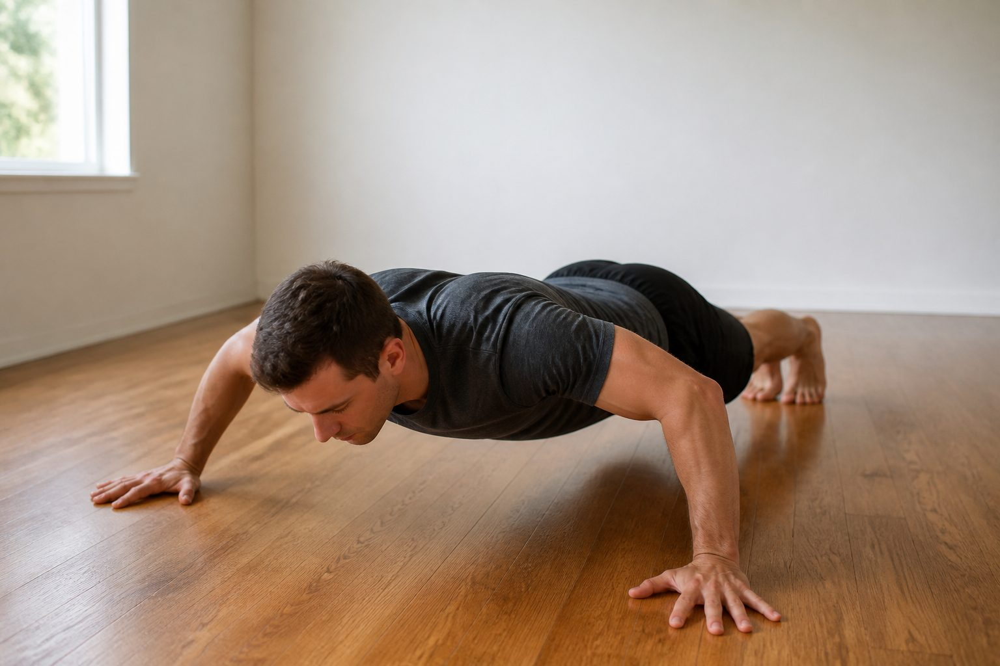

### pu-narrow — Narrow / hands-in

Hands closer than shoulders, still on the floor. Triceps, inner chest. Matches Friday “hands near center”.

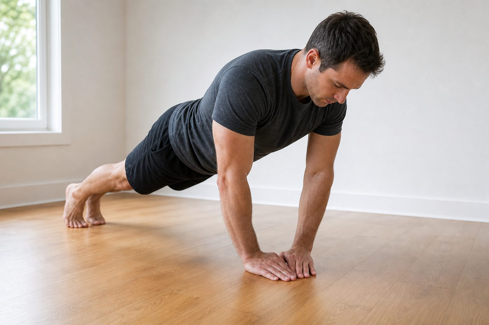

### pu-low — Hands-low / triceps

Hands lower on the ribs, elbows stay tucked. Triceps. Matches Friday “hands low”.

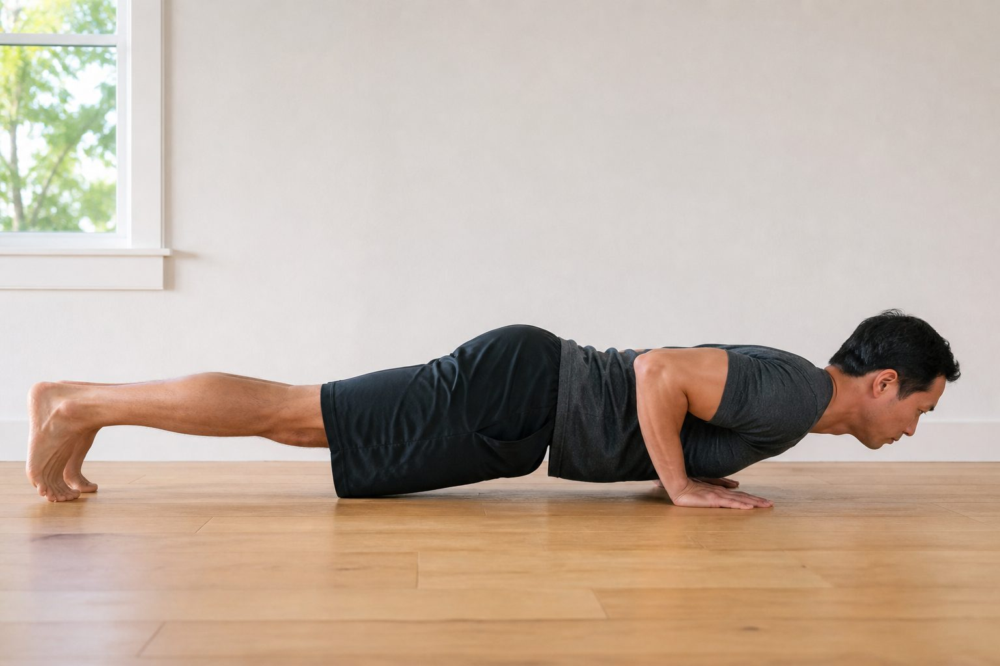

### pu-diamond — Diamond

Thumbs and index fingers touch under chest. When hands-low is too easy.

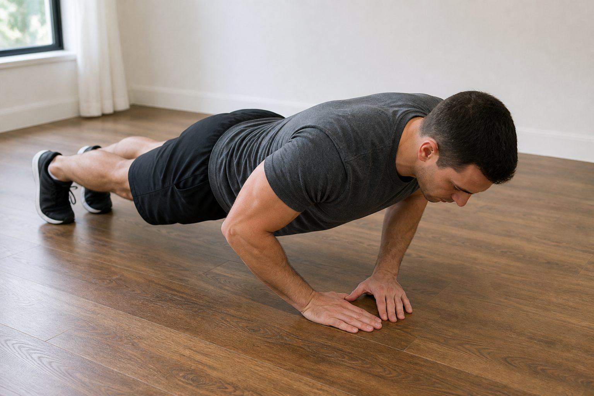

### pu-deficit — Deficit

Hands on books/blocks, chest between. Extra range.

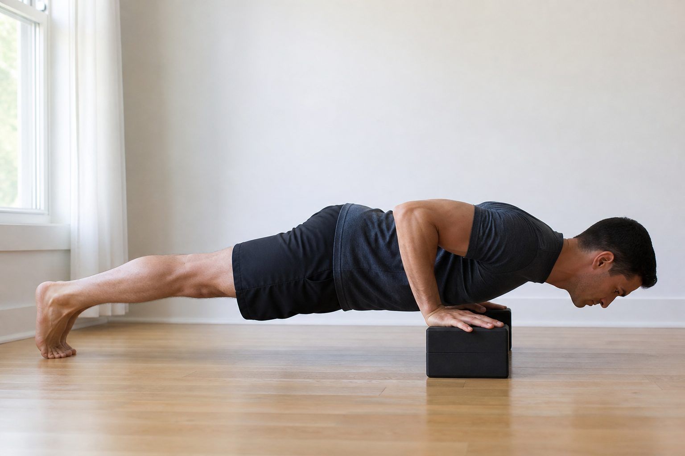

### pu-decline — Decline

Feet on a chair. Upper chest, shoulders.

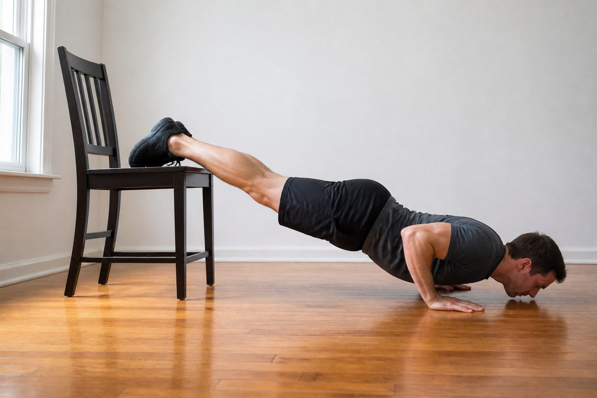

### pu-pike — Pike

Hips high, head toward floor. Shoulder work, not a chest default.

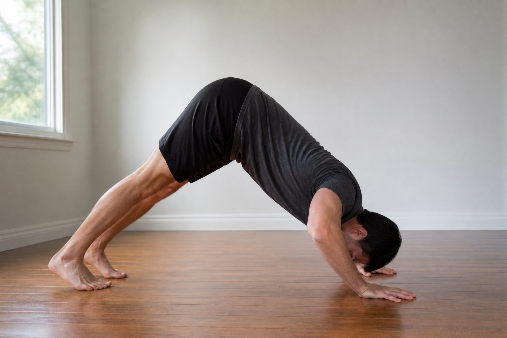

## Sets

For this program: **6 exercises in the session**, push-ups count as one or two of those. Example from 28 Aug: narrow 2×12, hands-low 1×12, both at RIR 2–3.

A set counts only if form holds. Stop 2–3 reps before failure (you could still grind 2–3 more clean reps).

Progress when RIR is above 3 (too easy): add 2–4 reps, add a set, or pick the next harder ID. Progress when you hit the listed reps with RIR 2–3 for two sessions in a row.

## Log names

Write the **ID** plus what you did:

`pu-narrow 2x12 RIR 2 — felt solid`

`pu-low 1x12 RIR 3 — last 2 grind`

We’ll map old wording (“push up, hands near center”) to IDs in the session log.
